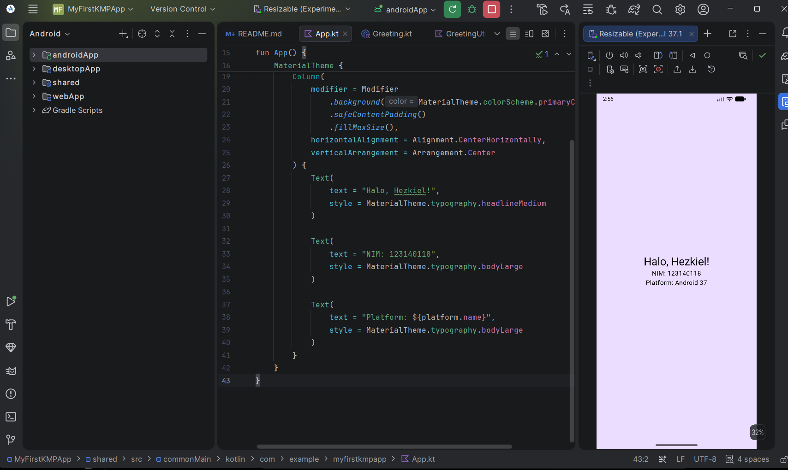
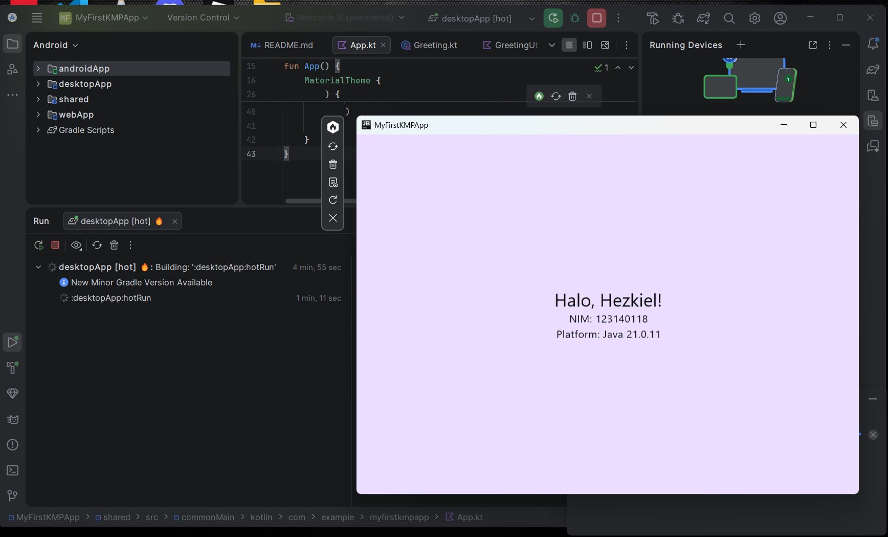

# MyFirstKMPApp

## Praktikum 1 - Kotlin Multiplatform

Aplikasi sederhana yang dibuat menggunakan **Kotlin Multiplatform (KMP)** untuk menampilkan identitas mahasiswa dan platform yang digunakan saat aplikasi dijalankan.

## Identitas

- **Nama:** Hezkiel
- **NIM:** 123140118
- **Program Studi:** Teknik Informatika
- **Mata Kuliah:** Pengembangan Aplikasi Mobile

## Fitur

Aplikasi menampilkan:

- Halo, Hezkiel!
- NIM: 123140118
- Platform yang sedang digunakan

## Platform

Project berhasil dijalankan pada:

- Android
- Desktop

## Screenshot

### Android



### Desktop




## Teknologi

- Kotlin Multiplatform
- Compose Multiplatform
- Gradle Kotlin DSL
- Android Studio
- Git & GitHub

## Struktur Project

```text
MyFirstKMPApp/
├── androidApp/
├── desktopApp/
├── shared/
├── webApp/
├── gradle/
├── build.gradle.kts
├── settings.gradle.kts
└── README.md